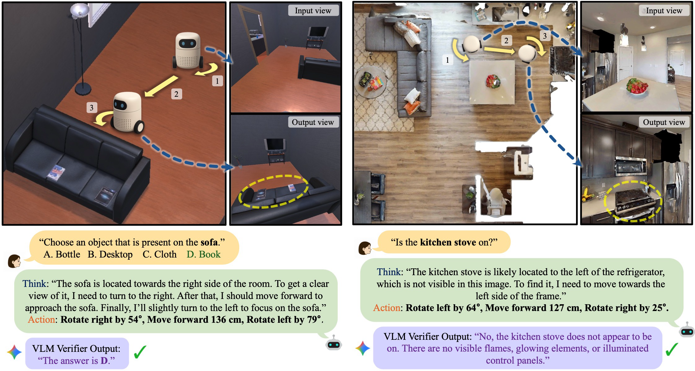

<h2>Toward Ambulatory Vision: Learning Visually-Grounded Active View Selection</h2>

[**Juil Koo***](https://63days.github.io) · [**Daehyeon Choi***](https://choidaedae.github.io) · [**Sangwoo Youn***]() · [**Phillip Y. Lee**](https://phillipinseoul.github.io/) · [**Minhyuk Sung**](https://mhsung.github.io) (* Equal Contribution)

KAIST

<b>arXiv 2025</b>

## TL;DR
<i>We introduce Visually Grounded Active View Selection (VG-AVS) Framework, enabling embodied agents to actively adjust their viewpoint for better Visual Question Answering using only current visual cues, achieving state-of-the-art performance on synthetic and real-world benchmarks.</i>

### Code - To be released!

